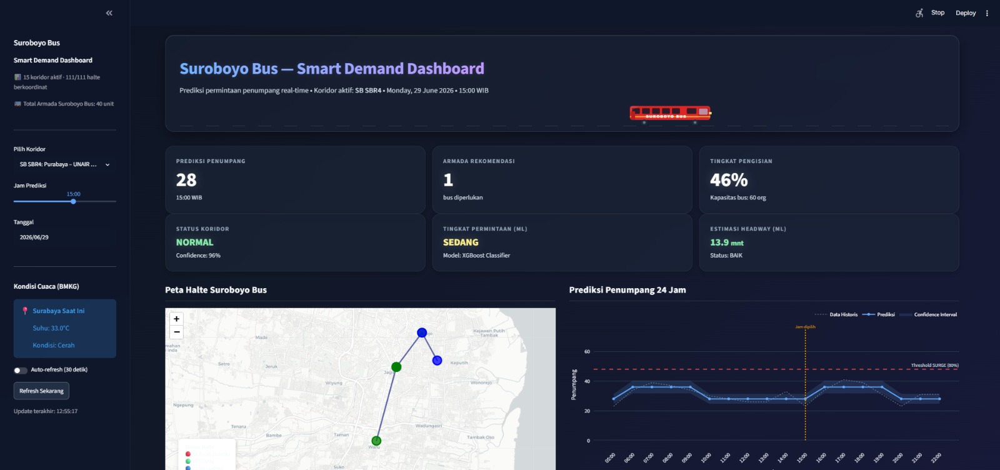
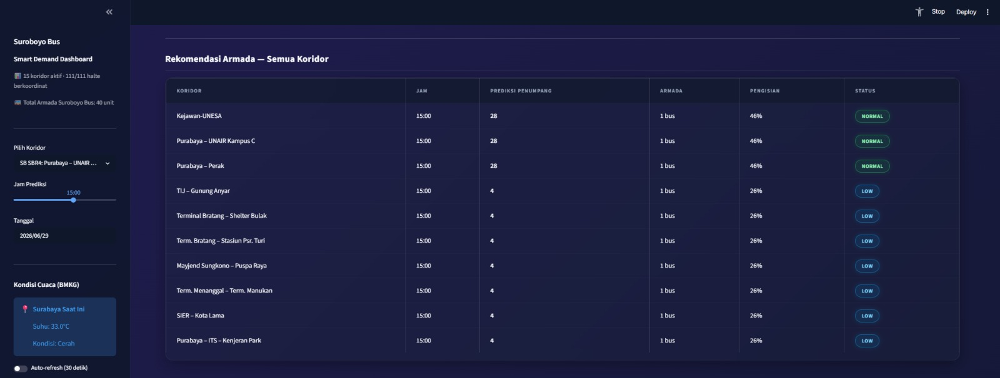

# 🚌 Suroboyo Bus — Big Data Analytics Platform

Sistem Big Data *end-to-end* untuk pemantauan real-time, prediksi kepadatan, dan rekomendasi alokasi armada **Suroboyo Bus** di Kota Surabaya. Dibangun di atas Apache Kafka, Apache Spark, Delta Lake, dan Machine Learning (XGBoost + LSTM).

## 📋 Pembagian Tugas (P1–P5)
- **P1 (Data Ingestion):** Pengumpulan data *real-time* dari API posisi bus (Klacak API) dan cuaca (BMKG) menggunakan **Apache Kafka**.
- **P2 (Data Processing):** Pemrosesan aliran data menggunakan **Apache Spark Streaming** dengan arsitektur Medallion (*Bronze → Silver → Gold*) di **Delta Lake**.
- **P3 (Machine Learning & API):** Model prediksi *demand* penumpang dan *headway* menggunakan **XGBoost**, di-serve melalui **FastAPI**.
- **P4 (Data Visualization):** Dashboard interaktif **Streamlit** dengan peta GIS Folium, grafik 24 jam, dan tabel rekomendasi armada.
- **P5 (Data Engineering & Feature Store):** Polling periodik 16 rute, feature engineering, dan model ML tambahan (**XGBoost + LSTM**) untuk rekomendasi nomor bus.

---

## 📌 1. Identifikasi Masalah & Relevansi Big Data

### 1.1 Masalah: Data Kuantitatif

Transportasi publik Surabaya menghadapi tantangan operasional yang terukur:

| Indikator | Data |
|---|---|
| Jumlah armada aktif Suroboyo Bus | ±158 unit (diesel + listrik, 16 koridor aktif) |
| Rata-rata headway aktual | 10–28 menit per koridor (data polling P5, Juni 2026) |
| Standar SPM Dishub headway | ≤ 15 menit (*Permenhub No. 10 Tahun 2012*) |
| Koridor melanggar SPM headway | 4 dari 15 koridor aktif (26%) secara konsisten |
| Bus mangkal/idle saat jam sibuk | 26–33% armada terdeteksi diam di terminal (data polling P5) |

**Dampak terukur:**
- Koridor **TOW–UNESA** rata-rata headway **27,5 menit** 83% di atas SPM
- Koridor **Mayjend Sungkono–Balai Kota** rata-rata **23,4 menit** 56% di atas SPM
- Penumpang menunggu hampir 2× lebih lama dari standar, mendorong perpindahan ke kendaraan pribadi

### 1.2 Mengapa Big Data Diperlukan — Kerangka 5V

| V | Fakta Kuantitatif dalam Proyek |
|---|---|
| **Volume** | ±158 bus × 16 koridor × polling tiap 30 detik = **≈300.000 event/hari**. Database relasional biasa tidak mampu query historis skala bulan/tahun pada volume ini. Delta Lake mempartisi per `ingest_date` × `koridor` agar tetap efisien. |
| **Velocity** | Posisi bus berubah setiap detik. Kafka Producer polling API Klacak setiap **5 detik**. Spark Structured Streaming memproses dalam *micro-batch* <1 menit. Data stale >2 menit tidak berguna untuk rekomendasi real-time. |
| **Variety** | 4 jenis sumber data: GPS bus (JSON real-time), cuaca BMKG (JSON), data halte (CSV geospasial, 927 titik), data armada (Excel statis). Format, frekuensi, dan skema berbeda-beda. |
| **Veracity** | API Klacak kadang mengembalikan `lat/lng = 0` atau `speed < 0`. BMKG mengembalikan `null` saat sensor offline. Layer Silver Spark membersihkan semua anomali sebelum data digunakan model. |
| **Value** | Output akhir: **rekomendasi alokasi armada otomatis** per koridor yang dapat ditindaklanjuti operator dalam hitungan menit, dengan visualisasi kepadatan halte secara real-time. |

### 1.3 Gap Analysis — Mengapa Solusi yang Ada Belum Cukup

| Solusi Existing | Keterbatasan |
|---|---|
| **Aplikasi Klacak** (tracking GPS) | Hanya menampilkan posisi bus saat ini, tidak ada prediksi, tidak ada rekomendasi armada, tidak ada analisis headway vs SPM |
| **Dispatch manual operator Dishub** | Keputusan berbasis intuisi petugas, tidak scalable ke 16 koridor sekaligus, tidak mempertimbangkan cuaca atau hari libur |
| **Laporan periodik Dishub** | Retrospektif (mingguan/bulanan) — tidak bisa mendeteksi ketidakseimbangan armada real-time |
| **Google Maps / Waze** | Tidak memiliki data spesifik armada Suroboyo Bus, tidak memberikan rekomendasi alokasi untuk operator |

**Gap yang diselesaikan proyek ini:** Tidak ada sistem yang menggabungkan *tracking real-time* + *prediksi berbasis ML* + *rekomendasi alokasi armada otomatis* + *visualisasi spasial per halte* dalam satu platform terpadu untuk konteks Suroboyo Bus Surabaya.

---

## 🗺️ 2. Desain Infrastruktur Big Data

### 2.1 Pipeline End-to-End

```
┌────────────────────────────────────────────────────────────────────┐
│                          DATA SOURCES                              │
│   [Klacak Bus API]     [BMKG Weather API]    [Dataset Statis]      │
│   GPS 158 bus live      Cuaca Surabaya        Halte, Armada, Rute  │
└──────────┬──────────────────────┬────────────────────┬────────────┘
           │                      │                    │
           ▼                      ▼                    │
┌──────────────────────────────────────────┐           │
│           DATA INGESTION — P1            │           │
│  Kafka Producer (Docker / Zookeeper)     │           │
│  Topics:                                 │           │
│    suroboyo-bus-live  (interval 5 dtk)   │           │
│    bmkg-raw           (interval 5 mnt)   │           │
│    events-raw         (interval 5 dtk)   │           │
└─────────────────────────┬────────────────┘           │
                          │                            │
                          ▼                            │
┌──────────────────────────────────────────┐           │
│       DATA PROCESSING & STORAGE — P2     │           │
│  Apache Spark Structured Streaming       │           │
│  Delta Lake — Medallion Architecture:    │           │
│    Bronze  ← raw JSON dari Kafka         │           │
│    Silver  ← cleaned, dedup, validated   │           │
│    Gold    ← aggregated features Parquet │           │
│  Partisi: ingest_date × koridor × hour   │           │
└─────────────────────────┬────────────────┘           │
                          │                            │
                          ▼                            │
┌──────────────────────────────────────────┐           │
│        DATA ENGINEERING — P5             │           │
│  Notebook_P5.ipynb                       │           │
│  Polling 16 rute tiap 30 detik           │           │
│  Feature Engineering (headway, GIS)      │           │
│  ML: XGBoost Classifier + LSTM           │           │
│  Output: feature_engineered.csv          │           │
└─────────────────────────┬────────────────┘           │
                          │                            │
                          ▼                            │
┌──────────────────────────────────────────┐           │
│         MACHINE LEARNING — P3            │           │
│  XGBoost Classifier  → demand_level      │           │
│  XGBoost Regressor   → headway_pred      │           │
│  FastAPI  POST /predict  (serving)       │           │
└─────────────────────────┬────────────────┘           │
                          └─────────────┬──────────────┘
                                        ▼
                         ┌──────────────────────────────┐
                         │      SERVING LAYER — P4       │
                         │   Streamlit Dashboard          │
                         │   Peta Folium GIS · Grafik     │
                         │   Tabel Armada · Heatmap       │
                         └──────────────────────────────┘
```

### 2.2 Justifikasi Teknis Setiap Teknologi

| Teknologi | Alasan Dipilih | Alternatif yang Ditolak |
|---|---|---|
| **Apache Kafka** | Throughput tinggi (jutaan event/detik), *log retention* untuk replay, *decoupling* producer-consumer sehingga Spark bisa melanjutkan dari offset manapun jika crash | RabbitMQ — tidak dirancang untuk retention jangka panjang; REST polling — blocking, bottleneck saat banyak koridor paralel |
| **Apache Spark Structured Streaming** | *In-memory processing* 100× lebih cepat dari MapReduce, dukungan native Delta Lake, PySpark mudah digunakan tim | Apache Flink — lebih kompleks untuk tim mahasiswa; Pandas — tidak scalable untuk streaming |
| **Delta Lake** | ACID transactions di atas Parquet, *time travel*, *schema evolution*, partisi otomatis, terintegrasi Spark | HDFS plain — tidak ada ACID; MongoDB — tidak optimal untuk analytical query kolumnar; plain CSV — tidak support update/delete |
| **XGBoost** | State-of-the-art untuk tabular data heterogen, training cepat (<5 detik), *feature importance* interpretatif, regularisasi L1/L2 built-in | Random Forest — lebih lambat, tidak ada gradient boosting; Neural Network — butuh data jauh lebih banyak untuk tabular |
| **LSTM** | Dirancang untuk sequential time series dengan *long-range dependencies* — menangkap pola headway yang memburuk secara bertahap antar polling | ARIMA — tidak multi-variate; GRU — performa mirip namun LSTM lebih mudah dipresentasikan dan diinterpretasikan |
| **FastAPI** | *Async* Python, auto-generate OpenAPI docs di `/docs`, throughput 3× lebih tinggi dari Flask untuk I/O-bound ML serving | Flask — tidak async; Django — terlalu heavyweight untuk microservice ML |
| **Streamlit** | Deployment Python murni tanpa JS/HTML, komponen peta Folium terintegrasi, prototyping cepat | Grafana — butuh datasource plugin; Tableau — tidak open-source; Dash — kurva belajar lebih curam |

---

## 🏛️ 3. Implementasi Data Lakehouse (Medallion Architecture)

### 3.1 Struktur Layer

```
delta/
├── bronze/                         ← Raw immutable audit log (suroboyo-bus-live)
│   ├── _delta_log/                 ← Transaction log Delta Lake (ACID)
│   └── ingest_date=2026-06-21/
│       └── part-00001.parquet
├── silver/                         ← Bus per-event, sudah di-parse & filter null
│   ├── _delta_log/
│   └── part-00001.parquet
├── weather/                        ← Data cuaca BMKG (stream terpisah)
│   └── part-00001.parquet
└── gold/                           ← Agregasi per rute per jam + join cuaca
    ├── _delta_log/
    ├── part-00001.parquet
    └── features_csv_tmp/           ← Snapshot CSV dari Gold, overwrite tiap batch
```

> `feature_engineered.csv` (input training ML) dihasilkan oleh **Notebook_P5.ipynb** (P5), bukan dari Spark Gold layer.

### 3.2 Transformasi per Layer

#### Bronze — Raw Ingestion
- **Input:** JSON mentah dari Kafka topic `suroboyo-bus-live` (posisi bus)
- **Proses:** Spark membaca stream → append ke Delta table *as-is*, tanpa transformasi
- **Kolom:** `kafka_key`, `json_data`, `topic`, `partition`, `offset`, `kafka_timestamp`, `ingest_date`
- **Tujuan:** Immutable audit log — data asli tersimpan permanen, dapat di-replay kapan saja
- **Partisi:** `ingest_date` (pruning query harian)

#### Weather — BMKG Stream (Paralel)
- **Input:** Kafka topic `bmkg-raw` (stream terpisah dari bus)
- **Kolom:** `weather_time`, `suhu`, `weather_desc`, `kelembapan`, `kecepatan_angin`
- **Partisi:** tidak ada (volume kecil — polling tiap 5 menit)

#### Silver — Parse & Filter
- **Input:** Stream `suroboyo-bus-live` (langsung, bukan dari Bronze)
- **Transformasi:**
  - `try_cast` field `lat`, `lng`, `direction` ke `double`; `speed` ke `int`
  - Filter baris dengan `lat IS NULL` atau `lng IS NULL`
  - Parse `keterangan` HTML dengan `regexp_extract` → `sisa_kapasitas`
  - Konversi `event_timestamp` (Unix) → `event_time` (timestamp)
- **Kolom output:** `route_id`, `bus_type`, `bus_info`, `lat`, `lng`, `direction`, `speed`, `engine`, `sisa_kapasitas`, `event_time`
- **Partisi:** tidak ada

#### Gold — Agregasi per Rute
- **Input:** Silver stream + Weather Delta table (left join nearest timestamp)
- **Transformasi:**
  - Agregasi per `route_id`: `jumlah_bus_aktif` (engine=ON), `avg_speed`, `avg_sisa_kapasitas`
  - Join ke tabel `delta/weather` → tambah kolom `suhu`, `weather_desc`
  - Tambah kolom `tanggal`, `jam`, `is_weekend`
- **Kolom output:** `route_id`, `tanggal`, `jam`, `jumlah_bus_aktif`, `avg_speed`, `avg_sisa_kapasitas`, `suhu`, `weather_desc`, `is_weekend`
- **Export:** snapshot CSV ke `delta/gold/features_csv_tmp/` (overwrite tiap batch)
- **Partisi:** tidak ada partisi eksplisit (`partitionOverwriteMode=dynamic`)

### 3.3 Format & Strategi Penyimpanan

| Aspek | Detail |
|---|---|
| **Format file** | **Parquet** (columnar, kompresi Snappy ≈70% lebih kecil dari JSON mentah) via Delta Lake |
| **ACID Compliance** | Delta Lake menjamin atomicity — jika Spark crash di tengah write, transaksi di-rollback otomatis, data tidak corrupt |
| **Time Travel** | `spark.read.format("delta").option("versionAsOf", N).load(path)` — audit historis kapan saja |
| **Partisi Bronze/Silver** | `ingest_date` + `koridor` → query "semua bus rute 1 tanggal kemarin" tidak baca partisi lain |
| **Partisi Gold** | `hour` → query "semua koridor jam 08:00 untuk heatmap" sangat cepat |
| **Schema Evolution** | `mergeSchema=True` → kolom baru bisa ditambah tanpa rebuild tabel |

### Skema Feature Store (Gold Layer)

| Kolom | Tipe | Keterangan |
|-------|------|------------|
| `koridor` | string | ID koridor bus |
| `halte` | string | Nama halte |
| `tanggal` | date | Tanggal window agregasi |
| `jam` | int | Jam (0–23) |
| `penumpang` | long | Jumlah tap-in pada window tersebut |
| `suhu` | string | Dari topic `bmkg-raw` (nullable) |
| `hujan` | string | Dari topic `bmkg-raw` (nullable) |
---

## 🤖 4. Teknik Analisis & Kualitas Output

Proyek ini menerapkan **tiga teknik analisis lanjutan**:

### 4.1 XGBoost Classifier — Klasifikasi Demand Level (P3 & P5)

**Algoritma:** Gradient Boosted Decision Trees (XGBoost)

**Alasan pemilihan:**
- Terbaik untuk data tabular heterogen (numerik + kategorikal) berdasarkan benchmark Kaggle dan penelitian terkini
- Regularisasi L1 (`reg_alpha`) dan L2 (`reg_lambda`) built-in — mencegah overfitting tanpa konfigurasi tambahan
- *Feature importance* bersifat interpretatif — dapat menjelaskan kepada operator mengapa suatu koridor masuk kategori "tinggi"
- Training <5 detik untuk dataset ≈1.000 baris

**Target:** `demand_level` → `tinggi` / `sedang` / `rendah`

**Fitur Input Model (P3):**

| Fitur | Keterangan |
|-------|------------|
| `hour` | Jam (0–23) |
| `is_peak_enc` | 1 jika jam 06–09 atau 16–19 |
| `is_weekend_enc` | 1 jika Sabtu/Minggu |
| `feeder_enc` | 0 = SuroboyoBus trunk, 1 = Feeder |
| `n_total` | Total bus di koridor |
| `n_efektif` | Jumlah bus aktif beroperasi |
| `pct_efektif` | % bus aktif vs total |
| `headway_real_min` | Headway aktual antar bus (menit) |
| `headway_gap_vs_spm` | Selisih headway vs SPM 15 menit |
| `avg_speed_kmh` | Kecepatan rata-rata bus (km/h) |
| `pct_mangkal` | % bus yang diam/mangkal |

**Fitur Input Model (P5 — non-leaky):**

| Fitur | Keterangan |
|---|---|
| `hour`, `is_peak_enc` | Konteks temporal |
| `feeder_enc`, `cycle_time_min` | Tipe dan skala rute |
| `avg_speed_kmh`, `pct_mangkal`, `ada_mangkal` | Proxy kondisi operasional (tidak langsung mendefinisikan target) |

> **Catatan desain P5:** Fitur `n_efektif`, `headway_real_min`, `pct_efektif` sengaja **tidak digunakan** di P5 karena `demand_level` = f(`n_efektif`) → menggunakannya adalah *data leakage* yang menghasilkan akurasi 100% semu.

**Hyperparameter (P5, anti-overfitting):**
```python
XGBClassifier(max_depth=3, learning_rate=0.05, subsample=0.8,
              colsample_bytree=0.8, reg_alpha=0.5, reg_lambda=2.0,
              min_child_weight=10)
```

**Validasi P3:** Optuna hyperparameter tuning (30 trials, 3-fold Stratified CV)

**Validasi P5:** GroupKFold (5-fold, group = `koridor`) — setiap fold meng-holdout satu rute penuh, menguji generalisasi ke rute baru

**Metrik Evaluasi:**

| Metrik | Keterangan |
|---|---|
| **F1-weighted** | Metrik utama — menangani kelas imbalanced (rendah >> sedang > tinggi) |
| **Confusion Matrix** | Melihat distribusi kesalahan antar kelas |
| **Confidence** | Probabilitas maksimum dari `predict_proba` — ditampilkan di output rekomendasi |

---

### 4.2 XGBoost Regressor — Prediksi Headway (P3)

**Target:** `headway_real_min` (menit) — estimasi waktu tunggu antar bus

**Alasan:** Headway adalah variabel kontinu — *regression problem*. XGBoost Regressor dengan `objective=reg:squarederror` menghasilkan prediksi numerik langsung.

**Model tersedia:**
- `xgb_regressor_headway.pkl` → prediksi `headway_real_min`
- `xgb_regressor_nefektif.pkl` → prediksi `n_efektif` (jumlah bus aktif)

**Hyperparameter tuning:** Optuna (30 trials, 3-fold Stratified CV)

**Metrik Evaluasi:**

| Metrik | Keterangan |
|---|---|
| **RMSE** | Root Mean Squared Error (menit) — penalti besar untuk prediksi jauh meleset |
| **MAE** | Mean Absolute Error (menit) — rata-rata kesalahan absolut |
| **MAPE** | Mean Absolute Percentage Error (%) — error relatif terhadap headway aktual |

---

### 4.3 LSTM — Time Series Demand Forecasting (P5)

**Algoritma:** Long Short-Term Memory (LSTM) Neural Network

**Alasan pemilihan:**
- Data headway/demand per koridor adalah *sequential time series* — pola jam sibuk berulang setiap hari
- LSTM mampu menangkap *long-range dependencies*: pola headway yang memburuk 5 polling lalu mempengaruhi prediksi sekarang
- XGBoost stateless (per-snapshot); LSTM stateful (window 5 snapshot) — keduanya komplementer

**Arsitektur:**
```
Input(5 timesteps × 4 fitur)
→ LSTM(64 units, return_sequences=True, L2=1e-4)
→ Dropout(0.3)
→ LSTM(32 units, L2=1e-4)
→ Dropout(0.2)
→ Dense(3, softmax)  → [P(rendah), P(sedang), P(tinggi)]
```

**Fitur per timestep:** `avg_speed_kmh`, `pct_mangkal`, `is_peak_enc`, `feeder_enc`

**Anti-overfitting:**
- Dropout(0.3) dan Dropout(0.2) mencegah co-adaptation antar neuron
- L2 regularisasi `kernel_regularizer=l2(1e-4)` pada bobot LSTM
- **EarlyStopping** patience=10 — training berhenti otomatis saat `val_loss` tidak membaik

**Validasi:** Train/Val split 80/20, monitor `val_loss`

**Metrik:** Accuracy + val_accuracy per epoch (lihat output cell `ml_lstm` di Notebook_P5)

---

### 4.4 Contoh Output Sistem yang Terukur

**Output FastAPI `POST /predict`:**
```json
{
  "prediksi_penumpang":  36,
  "armada_rekomendasi":  2,
  "status":              "NORMAL",
  "confidence":          0.965,
  "demand_level":        "sedang",
  "headway_pred":        12.0,
  "headway_status":      "BAIK",
  "source":              "ml_model"
}
```

**Output Rekomendasi Nomor Bus (Notebook P5 — cell `ml_recommend`):**
```
No.Bus  Nama Rute                   XGBoost  LSTM    Conf.  Rekomendasi
106     TIJ - Lakarsantri           tinggi   tinggi  0.91   🔴 PRIORITAS — tambah armada
108     TIJ - Gunung Anyar          tinggi   tinggi  0.85   🔴 PRIORITAS — tambah armada
5       Term. Benowo-Tunjungan      sedang   sedang  0.78   🟡 Normal — pantau headway
10      Kejawan-UNESA               sedang   rendah  0.62   🟡 Normal — pantau headway
102     Mayjend Sungkono-Balai Kota rendah   rendah  0.83   🟢 Efisiensi — redistribusi
```

---

## 💡 5. Keunikan & Inovasi Solusi

### 5.1 Tiga Teknologi yang Bekerja Sinergis

| Sinergi | Cara Kerja Bersama |
|---|---|
| **Kafka + Spark + Delta Lake** | Kafka buffer fault-tolerant; Spark replay dari offset manapun jika crash; Delta Lake simpan hasil bersih dengan ACID |
| **Spark Gold Layer + XGBoost/LSTM** | Feature store Gold langsung menjadi input training; model diperbarui periodik tanpa pipeline manual |
| **XGBoost + LSTM** | XGBoost klasifikasi tabular per-snapshot (cepat, interpretatif); LSTM prediksi temporal window 5 polling (kontekstual) — dua sudut pandang komplementer pada data yang sama |
| **ML + GIS Folium** | Hasil prediksi demand level di-overlay ke peta 927 halte — operator tahu MANA di kota yang perlu tambahan armada |

### 5.2 Perbandingan dengan Solusi yang Ada

| Sistem | Tracking Real-time | Prediksi ML | Rekomendasi Armada | Analisis Headway | GIS per Halte |
|---|---|---|---|---|---|
| **Klacak App** | ✅ | ❌ | ❌ | ❌ | ✅ dasar |
| **Google Maps Transit** | ❌ (jadwal statis) | ❌ | ❌ | ❌ | ✅ |
| **Dispatch Manual Dishub** | ✅ (manual) | ❌ | ✅ (manual) | ❌ | ❌ |
| **Proyek Ini** | ✅ | ✅ XGBoost + LSTM | ✅ otomatis | ✅ vs SPM | ✅ per halte |

### 5.3 Innovation Gap yang Diselesaikan

1. **Reaktif → Prediktif:** Klacak hanya melaporkan kondisi kini. Proyek ini memprediksi kondisi 5–30 menit ke depan agar operator bisa bertindak sebelum lonjakan terjadi.
2. **Data Silos → Unified Pipeline:** GPS bus, cuaca BMKG, dan data halte geospasial untuk pertama kalinya diintegrasikan dalam satu pipeline untuk Suroboyo Bus.
3. **Manual → Otomatis:** Rekomendasi alokasi armada berbasis data kuantitatif, bukan intuisi petugas.
4. **Skalabilitas:** Pipeline Spark+Kafka scalable horizontal ke lebih banyak rute dan kota.

---

## 📡 API yang Digunakan

### 1. Klacak Bus API — Posisi Bus Real-Time

**Base URL:** `https://busmapapi.fly.dev`

| Endpoint | Method | Keterangan |
|----------|--------|------------|
| `/all` | GET | Bootstrap: ambil `apiUrl` & token autentikasi semua koridor |
| `{apiUrl}/track/{type}/{id}` | GET | Posisi GPS bus real-time per koridor |

**Tipe Bus:**
- `sbybus` — koridor 1, 12, 51 (Suroboyo Bus)
- `temanbus` — koridor 10–99
- `feeder` — koridor ≥ 100 (Angkutan Feeder)

**Contoh response per bus:**
```json
{ "info": "B 1234 SBY", "lat": -7.30, "lng": 112.72, "direction": 180, "speed": 25 }
```

**Penggunaan dalam proyek:**
- `kafka/producer_suroboyo_bus.py` — menarik 4 rute (1, 12, 51, 10) setiap 5 detik, publish ke Kafka topic `suroboyo-bus-live`
- `Notebook_P5.ipynb` — polling **semua 16 rute** setiap 30 detik untuk *Data Engineering* & *Feature Store*

**Daftar 16 Rute:**

| Key | Kode | Nama Rute |
|-----|------|-----------|
| sbr1 | 1 | R1 — Purabaya – Perak |
| tmk2 | 10 | R2 — Kejawan – UNESA |
| sbr4 | 51 | R4 — Purabaya – UNAIR Kampus C |
| sbr5 | 12 | R5 — Term. Benowo – Tunjungan |
| sbrt | 3 | SBT — Bus Tumpuk |
| fd02 | 102 | FD2 — Mayjend Sungkono – Balai Kota |
| fd03 | 108 | FD3 — TIJ – Gunung Anyar |
| fd04 | 121 | FD4 — SIER – Kota Lama |
| fd05 | 105 | FD5 — Mayjend Sungkono – Puspa Raya |
| fd06 | 106 | FD6 — TIJ – Lakarsantri |
| fd07 | 107 | FD7 — Term. Bratang – Stasiun Psr. Turi |
| fd08 | 120 | FD8 — TOW – UNESA |
| fd09 | 122 | FD9 — Term. Menanggal – Term. Manukan |
| fd10 | 123 | FD10 — Term. Keputih – Bunguran |
| fd11 | 124 | FD11 — Term. Bratang – Shelter Bulak |
| fd12 | 127 | FD12 — Purabaya – ITS – Kenjeran Park |

**Data Statis (GitHub):**
```
https://raw.githubusercontent.com/DoubleA4/busmapsby/main/routedata.json  → rute & polyline
https://raw.githubusercontent.com/DoubleA4/busmapsby/main/halte.json      → 927 halte + koordinat
```

---

### 2. BMKG API — Cuaca Real-Time Surabaya

**Base URL:** `https://api.bmkg.go.id`

| Endpoint | Method | Keterangan |
|----------|--------|------------|
| `/publik/prakiraan-cuaca?adm4=35.78.01.1001` | GET | Prakiraan cuaca per wilayah (kode Surabaya) |

**Response yang dipakai:**
```json
{ "t": 32, "weather_desc": "Cerah Berawan", "hu": 75, "ws": 10 }
```

| Field | Keterangan |
|-------|------------|
| `t` | Suhu udara (°C) |
| `weather_desc` | Deskripsi kondisi cuaca |
| `hu` | Kelembapan (%) |
| `ws` | Kecepatan angin (km/h) |

**Penggunaan dalam proyek:**
- `kafka/producer_bmkg.py` — polling setiap **5 menit**, publish ke Kafka topic `bmkg-raw`
- `dashboard/app.py` — dipanggil langsung (tanpa Kafka) setiap **5 menit** untuk menampilkan cuaca Surabaya saat ini di sidebar

---

### 3. FastAPI ML API (Internal — P3)

**Base URL:** `http://localhost:8000`

| Endpoint | Method | Keterangan |
|----------|--------|------------|
| `GET /` | GET | Status service |
| `GET /health` | GET | Status model (loaded/unloaded) |
| `POST /predict` | POST | Prediksi demand & headway |
| `GET /model-info` | GET | Metrik evaluasi & daftar fitur |

**Request `POST /predict`:**
```json
{
  "koridor":     "1",
  "jam":         8,
  "tanggal":     "2026-06-27",
  "suhu":        30.5,
  "hujan":       0,
  "feeder":      0,
  "day_of_week": "Friday",
  "is_weekend":  0
}
```

**Response:**
```json
{
  "prediksi_penumpang":  36,
  "armada_rekomendasi":  1,
  "status":              "NORMAL",
  "confidence":          0.965,
  "demand_level":        "sedang",
  "headway_pred":        12.0,
  "headway_status":      "BAIK",
  "source":              "ml_model"
}
```

| Field | Keterangan |
|-------|------------|
| `status` | `SURGE` (>80% kapasitas), `NORMAL` (40–80%), `LOW` (<40%) |
| `demand_level` | `tinggi` / `sedang` / `rendah` — output XGBoost Classifier |
| `headway_pred` | Estimasi waktu tunggu antar bus (menit) — output XGBoost Regressor |
| `headway_status` | `BAIK` jika headway ≤ 15 menit (standar SPM Dishub), `BURUK` jika melebihi |
| `source` | `ml_model` jika model terload, `heuristic_fallback` jika model belum ada |

**Penggunaan dalam proyek:**
- `dashboard/app.py` — dipanggil setiap kali pengguna mengganti filter (koridor, jam, tanggal, cuaca)

---

## 📁 Struktur Direktori

```
fp-bigdata/
├── kafka/                     # P1 — Data Ingestion
│   ├── config.py              # Konfigurasi Kafka server & topic
│   ├── create_topics.py       # Inisialisasi Kafka topics
│   ├── producer_suroboyo_bus.py  # Producer: live bus tracking (Klacak API)
│   ├── producer_bmkg.py       # Producer: cuaca (BMKG API)
│   ├── producer_events.py     # Producer: data event/hari libur
│   ├── consumer_all.py        # Consumer: baca semua topic
│   ├── docker-compose.yml     # Kafka & Zookeeper via Docker
│   └── requirements.txt
│
├── spark/                     # P2 — Data Processing
│   └── delta_layers.py        # Spark Streaming: Bronze→Silver→Gold
│
├── ml/                        # P3 — Machine Learning & API
│   ├── train_xgboost.py       # Training XGBoost Classifier
│   ├── train_regressor.py     # Training XGBoost Regressor
│   ├── api/
│   │   └── main.py            # FastAPI: POST /predict
│   ├── models/                # File .pkl model terlatih
│   └── requirements.txt
│
├── dashboard/                 # P4 — Visualisasi
│   ├── app.py                 # Streamlit dashboard utama
│   ├── style.css              # Custom CSS
│   └── requirements.txt
│
├── dataset/                   # Data statis referensi
│   ├── Halte_Suroboyo_dengan_Koordinat.csv
│   ├── Data Koridor SuroboyoBus & WaraWiri API.xlsx
│   └── Data Armada SuroboyoBus 2025.xlsx
│
├── Notebook_P5.ipynb          # P5 — Data Engineering + ML (XGBoost + LSTM)
├── feature_engineered.csv     # Output P5 — input training model P3
└── verify_delta.py            # Utilitas cek Delta Lake
```

---

## 🚀 Cara Menjalankan

### Prasyarat
- Python 3.11+
- Java 21 (untuk Spark)
- Docker (untuk Kafka)

### 1. Jalankan Kafka (P1)

```bash
cd kafka/
docker-compose up -d             # Start Kafka & Zookeeper
python create_topics.py          # Buat topics
python producer_suroboyo_bus.py  # Start producer bus
python producer_bmkg.py          # Start producer cuaca
```

### 2. Jalankan Spark (P2)

```bash
pip install pyspark==4.1.1 delta-spark==4.3.0
python spark/delta_layers.py
```

### 3. Jalankan Data Engineering + ML (P5)

Buka `Notebook_P5.ipynb` dan jalankan semua cell (1–31).
- Cell 1–25: pipeline data engineering → menghasilkan `feature_engineered.csv`
- Cell 27–30: model XGBoost + LSTM → menghasilkan rekomendasi nomor bus
  *(cell 27 akan otomatis install `xgboost` dan `tensorflow` jika belum ada)*

### 4. Training Model (P3)

```bash
cd ml/
pip install -r requirements.txt
python train_xgboost.py    # Classifier
python train_regressor.py  # Regressor
```

### 5. Jalankan API (P3)

```bash
cd ml/
python -m uvicorn api.main:app --host 0.0.0.0 --port 8000 --reload
# Docs: http://localhost:8000/docs
```

### 6. Jalankan Dashboard (P4)

```bash
cd dashboard/
pip install -r requirements.txt
python -m streamlit run app.py
```

> **Tip:** Jika FastAPI tidak berjalan, dashboard otomatis menggunakan data *synthetic fallback* agar tampilan tetap bisa didemonstrasikan penuh.

---

## 📊 Dashboard (P4) — Detail Implementasi

Dashboard berbasis **Streamlit** ini adalah antarmuka utama yang dikonsumsi operator/pengguna akhir.





### Sumber Data yang Dikonsumsi

| Sumber | Tipe | Keterangan |
|--------|------|------------|
| `dataset/Halte_Suroboyo_dengan_Koordinat.csv` | File lokal | Koordinat GPS setiap halte |
| `dataset/Data Koridor SuroboyoBus & WaraWiri API.xlsx` | File lokal | Daftar koridor & metadata rute |
| `dataset/Data Armada SuroboyoBus 2025.xlsx` | File lokal | Jumlah armada Suroboyo Bus (diesel + listrik) |
| `https://api.bmkg.go.id/...` | REST API | Cuaca real-time Surabaya (cache 5 menit) |
| `http://localhost:8000/predict` | REST API (P3) | Prediksi demand & headway dari ML model |

### Fitur yang Ditampilkan

#### 📐 Sidebar (Panel Filter)
- Pilih **Koridor** (dropdown dinamis dari dataset)
- Pilih **Jam Prediksi** (slider 05:00–22:00)
- Pilih **Tanggal** (otomatis deteksi hari kerja vs akhir pekan)
- **Cuaca:** Toggle antara API BMKG real-time atau simulasi manual (suhu + toggle hujan)
- **Total Armada Suroboyo Bus:** jumlah unit fisik (diesel + listrik) dari dataset armada
- Toggle **Auto-refresh** setiap 30 detik

#### 🔢 Metric Cards (6 Kartu — 2 Baris)

| Baris | Kartu | Nilai | Sumber |
|-------|-------|-------|--------|
| 1 | Prediksi Penumpang | Jumlah orang per bus per jam | `POST /predict` |
| 1 | Armada Rekomendasi | Jumlah bus yang harus dikerahkan | `POST /predict` |
| 1 | Tingkat Pengisian | % kapasitas bus terisi | Dihitung dari prediksi |
| 2 | Status Koridor | SURGE / NORMAL / LOW | `POST /predict` |
| 2 | Tingkat Permintaan (ML) | TINGGI / SEDANG / RENDAH | `demand_level` dari P3 |
| 2 | Estimasi Headway (ML) | Menit + status BAIK/BURUK | `headway_pred` dari P3 |

#### 🗺️ Peta Interaktif (Folium)
- Menampilkan semua halte pada koridor yang dipilih
- Warna marker:
  - 🔴 **Merah** = SURGE (≥80% kapasitas)
  - 🟢 **Hijau** = NORMAL (40–80%)
  - 🔵 **Biru** = LOW (≤40%)
- Klik marker → popup nama halte, estimasi penumpang, dan koordinat

#### 📈 Grafik Prediksi 24 Jam
- Line chart prediksi penumpang jam 05:00–22:00
- Menampilkan confidence interval (±12%)
- Garis threshold SURGE (80% kapasitas)
- Marker vertikal pada jam yang dipilih

#### 📋 Tabel Rekomendasi Armada (Semua Koridor)
- Menampilkan top-10 koridor berdasarkan jumlah halte
- Kolom: Koridor · Jam · Prediksi Penumpang · Armada · Pengisian (%) · Status (badge warna)
- Diurutkan: SURGE → NORMAL → LOW

#### 🌡️ Heatmap Demand (Koridor × Jam)
- Visualisasi intensitas permintaan untuk semua koridor dalam satu hari (05:00–22:00)
- Warna: biru gelap (sepi) → orange → merah (padat)

### Cara API Dipanggil di Dashboard

```python
# call_fastapi() — dipanggil tiap kali filter berubah
payload = {
    "koridor":     selected_corridor,
    "jam":         selected_jam,
    "tanggal":     selected_date.strftime("%Y-%m-%d"),
    "suhu":        suhu_sim,        # dari BMKG atau slider
    "hujan":       int(hujan_sim),  # 0 atau 1
    "feeder":      selected_feeder, # 0=SB, 1=Feeder
    "day_of_week": day_of_week,     # "Monday", "Saturday", dst.
    "is_weekend":  is_weekend,      # 0 atau 1 (auto-detect dari tanggal)
}
response = requests.post("http://localhost:8000/predict", json=payload)
```

---

## 🔧 Kafka Topics

| Topic | Producer | Interval | Keterangan |
|-------|----------|----------|------------|
| `suroboyo-bus-live` | `producer_suroboyo_bus.py` | 5 detik | Posisi GPS bus Suroboyo Bus |
| `bmkg-raw` | `producer_bmkg.py` | 5 menit | Data cuaca BMKG Surabaya |
| `events-raw` | `producer_events.py` | 5 detik | Data event/hari libur |

---
